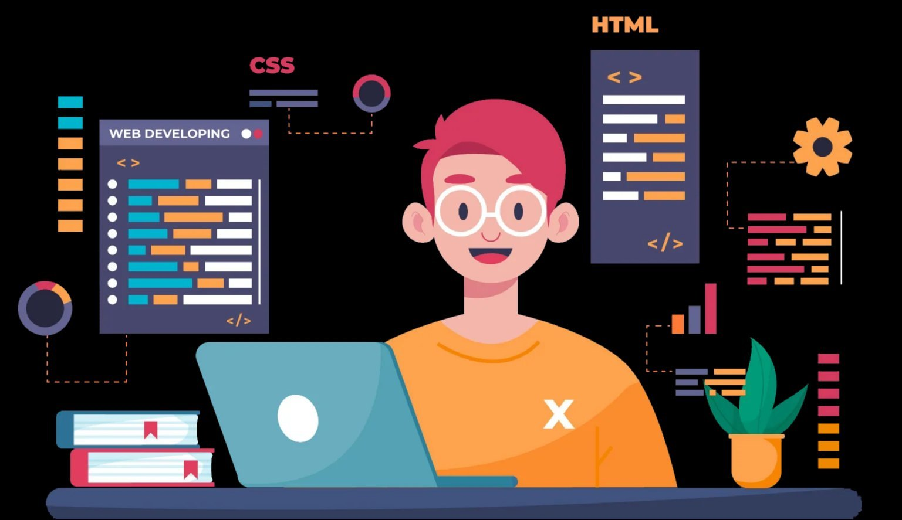

  

<h1 align="center">Hi , I'm Mitalikumari Patel 👩‍💻</h1>

<h3 align="center">A Passionate Software Engineer from India 🇮🇳</h3>
---

#  About Me:
 
I am a final-year undergraduate student at Pandit Deendayal Energy University, pursuing a Bachelor's in Information and Communication Technologies (ICT). I am a passionate Web developer with strong interests in HTML, CSS3, JavaScript, ReactJS, Bootstrap 5, Tailwind CSS, MySQL. I actively explore and implement modern web technologies, while also contributing to open-source and research projects, particularly in AI for healthcare.
  

- 🎓 Final-year B.Tech student at Pandit Deendayal Energy University in ICT
- 💻 Passionate about Full-Stack Web Development, and Deep Learning learning opportunity.
- 🌐 Technologies: HTML, CSS3, JavaScript, ReactJS, Bootstrap 5, Tailwind CSS, MySQL
- 📚 Exploring AI in Healthcare & contributing to Open Source
- 📌 Pronouns: She/Her
- 🤓 Fun fact: Programmers don’t die, they just go offline😝

# 🌐 Tech Stack
              
<table align="center">
  <tr align="center">
    <td></td>
    <td></td>
    <td></td>
    <td></td>
    <td></td>
  </tr>
  <tr align="center">
    <td></td>
    <td></td>
    <td></td>
    <td></td>
    <td></td>
  </tr>
  <tr align="center">
    <td></td>
    <td></td>
    <td></td>
    <td></td>
    <td></td>
  </tr>
</table>

<!--Github stats Table--> 
<h2>📊 Gɪᴛʜᴜʙ Sᴛᴀᴛs 📊</h2>

  <table>
    <tr>
      <td>
        <h3 align="center"><strong>Gɪᴛʜᴜʙ Sᴛᴀᴛs</strong></h3>
        

          
        

      </td>
    </tr>
  </table>

 

<!--Contribution Graph-->
<h2>📈 Cᴏɴᴛʀɪʙᴜᴛɪᴏɴ Gʀᴀᴘʜ 📈</h2>

    

---

<h2>🏆 Achievements </h2> 

- 🧠 **Deep Learning Research**: Designed CNN+BiLSTM and ResNet1D models for **Sleep Apnea Detection** using ECG signals with **96.10% accuracy** (Major Project, PDEU).
- 📜 **IEEE Publications**:
  - [Sleep Stages Classification using Multi-Channel EEG](https://ieeexplore.ieee.org/document/10899511) – 8th IEEE Conference on ICT.
  - [Automatic Sleep Staging using 1D CNN](https://ieeexplore.ieee.org/document/10985440) – 3rd IEEE IATMSI Conference.
- ✍️ **Research Accepted / Submitted**:
  - Accepted: *Predictive Modeling for Urban Flood Risk Mitigation* – Intl. Conf. on Smart Computing & Applications.
  - Submitted: *Improved Sleep Apnea Diagnosis Using CNN-BiLSTM* – International Journal of Advanced Technology and Engineering Exploration (IJATEE.2025.121220711).
- 🏅 **Certifications**:
  - NPTEL – *Social Networks*
  - Simplilearn – *Front-End Development*

---

<!--Dynamic Quote card updates everyday at 12 PM--> 
<h2 align="center">🌟 Tʜᴏᴜɢʜᴛ ᴏғ ᴛʜᴇ Dᴀʏ 🌟</h2>

<!--STARTS_HERE_QUOTE_CARD-->

    

<!--ENDS_HERE_QUOTE_CARD-->

<!--Contact Section--> 

<h2 align="center">🤝 Cᴏɴɴᴇᴄᴛ Wɪᴛʜ Mᴇ 🤝 </h2>

  

 

 <em><b>I love connecting with different people</b> so if you want to say <b>hi, I'll be happy to meet you more!</b> 😊</em>

 

<!--Footer--> 

  

